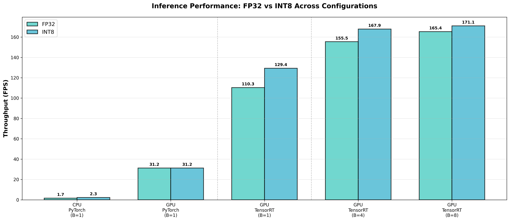
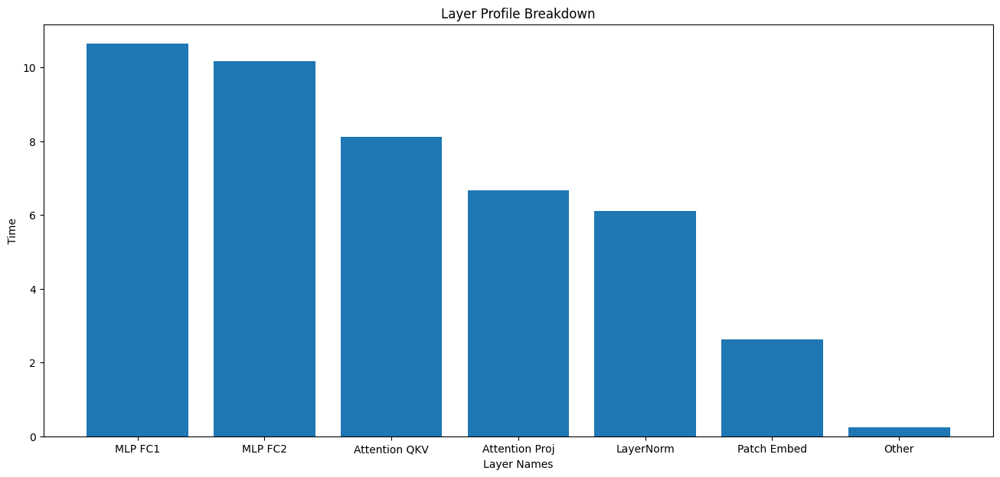

# Swin Transformer Inference Optimization on NVIDIA Jetson Orin

## Overview
Achieved 4.1x inference speedup through TensorRT optimization and INT8 quantization while maintaining model functionality.

## Results
**Performance comparison**

**Layer Profile**

## Key Findings
1. **TensorRT graph optimization provided 3.5x speedup** through kernel fusion 
   and memory layout optimization
2. **INT8 quantization added 1.17x improvement** on top of TensorRT FP32
3. **Memory bandwidth is the bottleneck** - INT8 benefits diminish with larger 
   batches due to data movement overhead
4. **Model compression: 4x** for weights (110MB → 28MB)

## Technical Deep Dive

### Profiling Analysis
- Identified Linear layers (MLP + Attention) consume 72% of compute time
- Nsight Systems showed implicit_convolve_sgemm as primary bottleneck
- Memory operations limit INT8 speedup on edge hardware

### Optimization Techniques Applied
- Post-training quantization (PTQ) to INT8
- TensorRT graph optimization (operator fusion, constant folding)
- Batch processing for throughput optimization
- Hardware-specific compilation for Jetson Orin

### Limitations Discovered
- Vision Transformers on edge devices are memory-bandwidth bound
- INT8 Tensor Cores underutilized at small batch sizes
- Swin's window attention mechanism has significant memory overhead

## Deployment
- Exported to ONNX (opset 17)
- Converted to TensorRT engines (FP32 and INT8)
- Optimized for batch sizes 1-8
- Ready for production deployment on Jetson Orin

## Tools Used
- PyTorch for model development
- NVIDIA Nsight Systems for profiling
- TensorRT for inference optimization
- ONNX for model portability

## Future Work
- Quantization-aware training (QAT) for accuracy recovery
- Larger batch processing for throughput-oriented applications
- Investigation of mixed-precision strategies
- Custom CUDA kernels for memory-bound operations